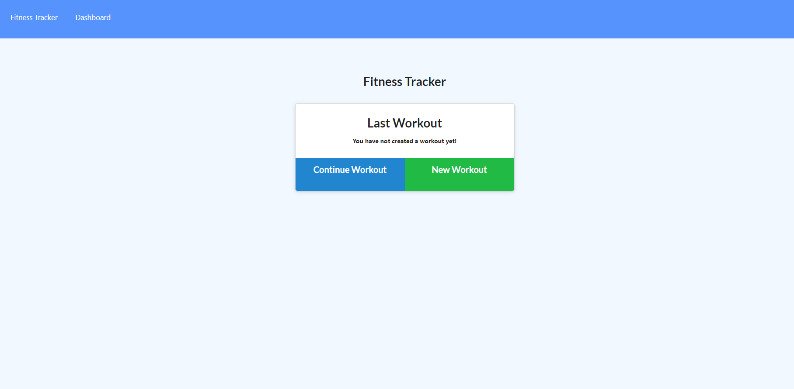

# Nosql-Workout-Tracker
This app helps you view create and track daily workouts

## Description
For this assignment, you'll create a workout tracker. You have already been provided with the front end code in the Develop folder. This assignment will require you to create Mongo database with a Mongoose schema and handle routes with Express.

## User Story
As a user, I want to be able to view create and track daily workouts. I want to be able to log multiple exercises in a workout on a given day. I should also be able to track the name, type, weight, sets, reps, and duration of exercise. If the exercise is a cardio exercise, I should be able to track my distance traveled.

## Business Context
A consumer will reach their fitness goals more quickly when they track their workout progress.

## Table of Contents
* Insallation

* Usage

* Test

* Questions

## Insallation
To install necessary dependencies run the following command:

npm i -y 

## Test
To run tests, run the following command:

 node server.js

## Usage
Here are some steps for the user:

download Repo and Run npm i to install modules then node server.js to launch port

## Questions
If you have any questions or concern please email me at: p_aston@hotmail.co.uk or find my work on github odders17

## Deployed Link and github repo

https://workout-tracker-odders17.herokuapp.com/

https://github.com/odders17/Nosql-Workout-Tracker

